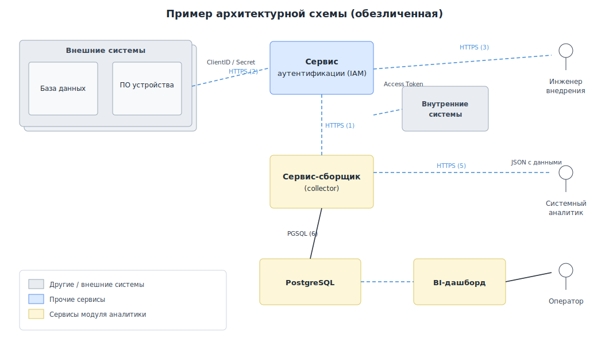

# 🛡️ Интеллектуальная система формирования требований ИБ

ИИ-агент, который по **архитектурной схеме** программной системы автоматически формирует перечень применимых **требований информационной безопасности**. На вход подаётся изображение схемы и параметры системы (класс критичности, наличие персональных данных) — на выходе получается структурированный список требований ИБ и аналитический отчёт.

> 🎓 Курсовой проект по дисциплине «Методы интеллектуального анализа данных в задачах защиты информации», Уфимский университет науки и технологий, 2026.

---

## 💡 Какую задачу решает

Формирование требований ИБ при проектировании систем — трудоёмкий процесс: специалист вручную анализирует архитектуру и сверяет её с нормативным документом, который может содержать сотни требований, сгруппированных по разделам. Это занимает много времени, а из-за человеческого фактора часть требований легко пропустить.

Проект автоматизирует этот анализ: агент «читает» схему, понимает архитектуру системы и сам подбирает применимые требования, сокращая трудозатраты специалиста и снижая риск пропуска критичных мер защиты.

---

## 🧠 Как это работает

Агент работает по многошаговому конвейеру:

1. **Распознавание схемы (OCR).** Изображение архитектурной схемы обрабатывается через Yandex Vision — извлекается весь текст (компоненты, потоки данных, протоколы).
2. **Анализ архитектуры (LLM).** YandexGPT по распознанному тексту выделяет компоненты, потоки данных и архитектурные признаки (есть ли API, БД, IAM, ПДн, веб-доступ) и возвращает их в структурированном JSON.
3. **Трёхэтапный отбор требований:**
   - фильтрация по классу критичности системы (низкий / средний / высокий);
   - контекстная фильтрация по архитектурным признакам;
   - ранжирование по **TF-IDF**-сходству с описанием архитектуры (топ-N релевантных).
4. **Генерация отчёта (LLM).** Формируется аналитический отчёт: резюме системы, ключевые риски, приоритеты выполнения.
5. **Оценка качества.** Результат сравнивается с эталонными требованиями эксперта по метрикам **Precision / Recall / F1** (сопоставление через косинусное сходство TF-IDF).

Дополнительно реализовано **few-shot обучение** — агенту показывают примеры «схема → правильные требования» для повышения точности.

---

## 🛠️ Технологии

| Технология | Назначение |
|------------|------------|
| **Python** | Основной язык |
| **Яндекс AI (YandexGPT)** и **Сбер GPT (GigaChat)** | Анализ архитектуры и генерация отчёта (две сравниваемые модели) |
| **Yandex Vision (OCR)** | Распознавание текста с архитектурной схемы |
| **scikit-learn** | TF-IDF-векторизация и косинусное сходство |
| **pandas / openpyxl** | Обработка данных и выгрузка результатов в Excel |
| **Google Colab** | Среда запуска ноутбука |

> В рамках исследования агент был реализован и сравнён на двух языковых моделях — **Сбер GPT (GigaChat)** и **Яндекс AI (YandexGPT)**. В этом репозитории приведена реализация на Яндекс AI.

---

## 🖼️ Пример входных данных

На вход агент получает **архитектурную схему** системы. Ниже — обезличенный пример подобной схемы: внешние системы, сервис аутентификации (IAM), сервис-сборщик, база данных PostgreSQL и BI-дашборд с потоками данных по HTTPS.

<p align="center">
  
</p>

> Реальные схемы анализируемых систем являются корпоративными и в репозиторий не включены — приведён только обобщённый иллюстративный пример.

---

## 📊 Результаты

Тестирование проводилось на архитектурной схеме веб-системы с IAM-аутентификацией (OAuth2/JWT), микросервисом, базой данных PostgreSQL и внешним ИИ-сервисом (класс критичности — низкий, обрабатываются персональные данные). Эталон — **49 требований**, размеченных экспертом вручную.

**Итоговое качество** (few-shot обучение, после ручной корректировки потоков данных):

| Модель | Режим | Precision | Recall | F1 |
|--------|-------|:---:|:---:|:---:|
| Яндекс AI | без обучения | 42.0% | 43.1% | 42.5% |
| **Яндекс AI** | **few-shot (2–3 примера)** | **56.0%** | **57.1%** | **56.5%** |
| Сбер GPT | без обучения | 34.0% | 34.9% | 34.4% |
| Сбер GPT | few-shot (2–3 примера) | 46.0% | 46.9% | 46.4% |

**Ключевые выводы:**

- **Few-shot обучение** заметно повышает качество: F1 вырастает примерно на 12–15 п.п. по сравнению с режимом без обучения. Наибольший прирост дают первые 1–2 примера, дальше эффект ослабевает.
- **Яндекс AI точнее Сбер GPT** на ~10 п.п. — вероятно, за счёт предварительного OCR-извлечения текста схемы, дающего модели более полный контекст.
- **Ручная корректировка потоков** добавляет несколько дополнительных совпадений — подтверждает пользу гибридного подхода «агент + специалист».
- Оптимальный порог TF-IDF-сходства — **0.35**.
- **Лучший результат:** Яндекс AI + few-shot после редактирования — **F1 ≈ 56%** (около 28 из 49 требований эксперта).

> Ограничения: эксперименты проведены на одной тестовой схеме и с разметкой одного эксперта; результаты носят предварительный характер, для надёжных выводов нужна проверка на нескольких архитектурах разных классов критичности.

---

## 🔍 Объяснение результатов

**Почему помогает few-shot обучение.** Модель не дообучается — примеры «схема → правильные требования» передаются прямо в промпте. Они задают модели образец рассуждения и терминологию предметной области, поэтому она точнее подбирает применимые требования. Наибольший эффект дают первые один-два примера, дальше прирост ослабевает — это характерно для few-shot.

**Почему Яндекс AI точнее.** В версии на Яндексе схема сначала проходит OCR, и в промпт попадает готовый текст со всеми компонентами и подписями. Сбер GPT анализирует изображение нативно, без явного текстового контекста, поэтому чаще упускает детали — отсюда стабильное преимущество Яндекса примерно на 10 п.п.

**Почему помогает ручная корректировка потоков.** OCR и модель не всегда верно распознают все связи на схеме. Когда специалист поправляет таблицу потоков, активируются дополнительные архитектурные признаки (наличие БД, IAM, внешнего ИИ-сервиса и т.д.), и отбор требований становится полнее. Это подтверждает ценность гибридного сценария «агент готовит черновик — специалист уточняет».

**Ограничение метрики.** Совпадение требований определяется по TF-IDF-сходству формулировок, то есть по поверхностному тексту. Требования с одинаковым смыслом, но разной формулировкой могут не засчитаться как совпавшие — поэтому фактическое качество может быть несколько выше измеренного.

**Почему точность умеренная.** Итоговый F1 порядка 56% отражает объективную сложность задачи, а не только ограничения прототипа. Основные причины:

- **Сложность самой задачи.** Сопоставить схематичное изображение с большим каталогом из сотен близких по формулировке требований трудно даже квалифицированному специалисту — часть требований неизбежно трактуется неоднозначно.
- **Отсутствие дообучения.** Использовались базовые модели без fine-tuning: они слабо знакомы со специализированной корпоративной терминологией ИБ и опираются только на промпт и few-shot-примеры.
- **Ошибки OCR.** На схемах мелкий текст, стрелки и пересекающиеся подписи распознаются неточно, и эти ошибки распространяются на дальнейший анализ.
- **Заниженная оценка метрикой.** TF-IDF учитывает совпадение слов, а не смысла, поэтому верно подобранные, но иначе сформулированные требования засчитываются как ошибки — реальная точность выше измеренной.
- **Ограниченность эксперимента.** Одна тестовая схема и эталон от одного эксперта создают «шумную» базовую линию: при проверке на большем числе схем и с несколькими экспертами оценка стала бы устойчивее.

Таким образом, полученные значения — это разумная стартовая точка для прототипа, а не потолок метода: основные направления роста (дообучение моделей, улучшение OCR, семантические метрики) описаны ниже.

---

## 🚀 Дальнейшие пути развития

- Оформить агента как **FastAPI-микросервис** с возможностью интеграции в CI/CD-пайплайн разработки.
- Расширить базу требований до полного нормативного документа.
- Реализовать **постоянное хранение обучающих примеров** в базе данных.
- Добавить **Telegram-бота** для удобного доступа сотрудников к агенту.
- Проверить агента на **5–10 архитектурах** разных классов критичности и с разметкой нескольких экспертов.
- Исследовать применимость **дообученных (fine-tuned)** русскоязычных языковых моделей для дальнейшего повышения точности.

---

## 📁 Структура репозитория

```
├── security_requirements_agent.ipynb   # основной ноутбук (Google Colab)
├── requirements.txt                     # зависимости
├── .env.example                         # шаблон для ключей
├── .gitignore
└── examples/
    └── architecture_example.svg         # обезличенный пример архитектурной схемы
```

---

## 🚀 Как запустить

Ноутбук рассчитан на **Google Colab**.

1. Открой `security_requirements_agent.ipynb` в [Google Colab](https://colab.research.google.com/).
2. Получи доступ к [YandexCloud Foundation Models](https://cloud.yandex.ru/services/foundation-models) — понадобится **API-ключ** сервисного аккаунта и **folder_id**.
3. В Colab слева нажми значок 🔑 (**Секреты**) и добавь два секрета:
   - `YANDEX_API_KEY` — твой API-ключ;
   - `YANDEX_FOLDER_ID` — идентификатор каталога.
4. Выполняй ячейки по порядку: установка → ключи → база требований → функции → (обучение) → запуск → сравнение с экспертом.
5. На шаге запуска загрузи изображение архитектурной схемы; результаты выгрузятся в Excel.
6. **Выбор модели:** в ячейке с функциями GigaChat есть переключатель `MODEL` — задай `'yandex'` для Яндекс AI или `'gigachat'` для Сбер GPT. Один и тот же конвейер запускается на обеих моделях, что позволяет сравнить их метрики. Для GigaChat нужен секрет `GIGACHAT_AUTH_KEY`.

> 🔒 Ключи API нигде не хранятся в коде — они читаются из «Секретов» Colab или переменных окружения. Не публикуй свои ключи.

---

## 🔑 Как получить API-ключи

### Яндекс AI (YandexGPT)

1. Зарегистрируйся в [Yandex Cloud](https://console.cloud.yandex.ru/) и создай каталог — его идентификатор `folder_id` понадобится (он входит в адрес модели `gpt://{folder_id}/yandexgpt/latest`).
2. Открой раздел **Сервисные аккаунты** → **Создать сервисный аккаунт**, задай имя и назначь роль `ai.languageModels.user`.
3. Зайди внутрь сервисного аккаунта → **Создать новый ключ** → **Создать API-ключ**, скопируй значение.
4. В коде используются два значения: `YANDEX_API_KEY` (API-ключ) и `YANDEX_FOLDER_ID` (идентификатор каталога).

> Частая ошибка: ключ от одного каталога, а модель указана с чужим `folder_id` — будет ошибка 403.

### Сбер GPT (GigaChat)

1. Зарегистрируйся в [Сбер Studio](https://developers.sber.ru/studio/) через телефон или Сбер ID.
2. Нажми **Создать проект** и выбери GigaChat API — система выдаст **Client ID** и **Client Secret**.
3. Сформируй **Authorization Key**: строку `Client ID:Client Secret` закодируй в **Base64** (в интерфейсе Studio ключ можно получить готовым — раздел «Настройки API» → «Получить ключ»).
4. По этому ключу код обменивает его на **токен доступа** (запрос `POST` на `https://ngw.devices.sberbank.ru:9443/api/v2/oauth`). Токен действует 30 минут и обновляется автоматически.
5. В коде используется одно значение: `GIGACHAT_AUTH_KEY` (Authorization Key).

> ⚠️ Для обоих сервисов ключи храни в «Секретах» Colab или в `.env`, а не в коде.

---

## ⚠️ Примечания

- База требований `REQUIREMENTS_DB` и таблица потоков данных в ноутбуке **не содержат реальных корпоративных данных**. Приведены только вымышленные обобщённые примеры, показывающие формат работы алгоритма. Настоящий перечень требований является внутренним нормативным документом и в репозиторий не включён.
- Проект носит исследовательский, учебный характер.

---

## 📚 Чему я научилась

- Проектировать **многошаговых LLM-агентов** и связывать несколько ИИ-сервисов в единый конвейер.
- Работать с **мультимодальными моделями** и OCR для анализа изображений и технической документации.
- Применять **few-shot обучение** для повышения качества на прикладной задаче.
- Строить объективную **методику оценки** (Precision / Recall / F1) и сравнивать модели.
- Использовать **TF-IDF и косинусное сходство** для семантического сопоставления текстов.

---

## 👩‍💻 Автор

**Михайлова Ангелина**, группа ИБ-432 · Уфа, 2026
Email: mihajlovaangelina04@gmail.com

---

*Учебный проект. Код открыт для ознакомления.*
